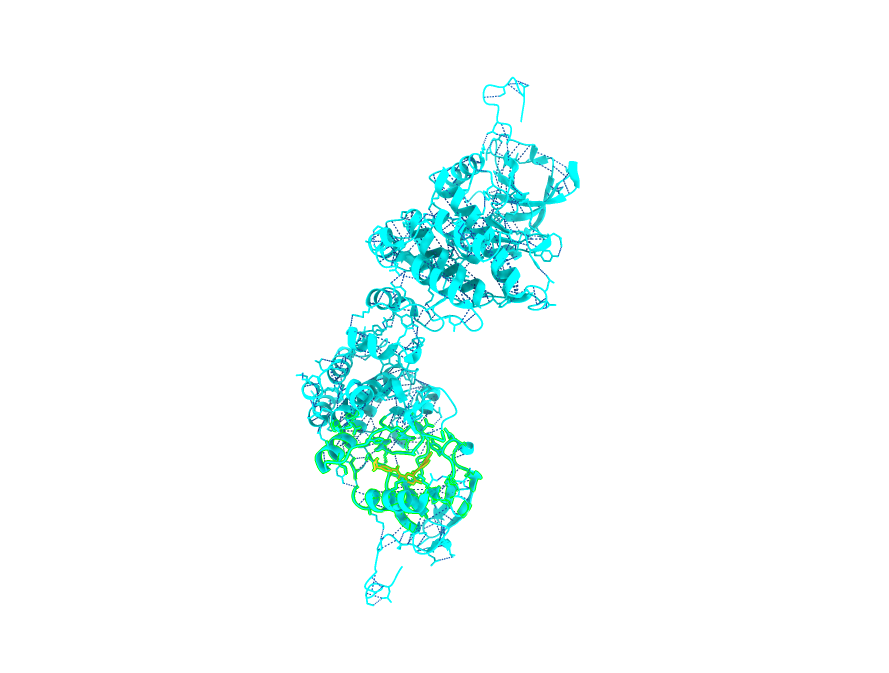
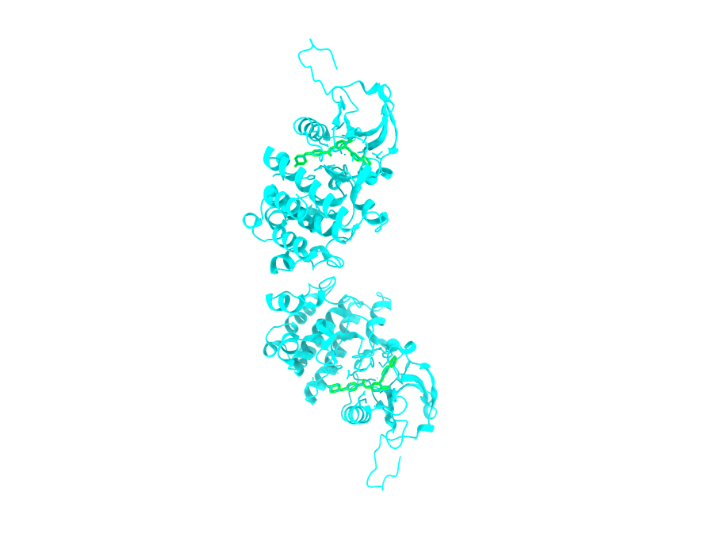

# Molecular docking experiments

Molecular docking modeling technique that studies how two or more molecular structures fit together. \
It predicts how a receptor molecule (e.g. protein) interacts with and binds to a ligand (e.g. small molecule or a drug).

Docking aims to identify the correct poses of ligands in the binding pocket of a receptor and predict the binding affinity between the receptor and the ligand.

## Experiment 1: Redocking of imatinib to mouse c-Abl kinase protein

### Background

This project aims to reproduce the binding of **imatinib**, a tyrosine kinase inhibitor, to the **mouse c-Abl kinase protein** using molecular docking.

### Structural data sources 
 
Crystal structure of the mouse c-Abl kinase protein in complex with imatinib (PDB ID: 1IEP): https://www.rcsb.org/structure/1IEP

Imatinib structure from PubChem: https://pubchem.ncbi.nlm.nih.gov/compound/5291

### Workflow

- Prepared the protein by removing the co-crystallized ligand and water molecules.
- Prepared imatinib as a flexible ligand.
- Performed docking with Autodock Vina.
- Visualised the binding interactions and compared.
- Compared the docked pose of the ligand with the initial crystal structure.

### Tools
- ChimeraX: used for visualisation and removal of ligand and water from the protein.
- Meeko: protein and ligand prep as well as file conversion.
- Autodock Vina: redocking.

### Results

Imatinib (yellow) bound to one of the original binding sites on the mouse c-Abl kinase protein (cyan) after redocking. The hydrogen bonds are highlighted in blue dashed lines.

Original crystal structure of c-Abl kinase protein with imatinib bound at two sites (green)

 

